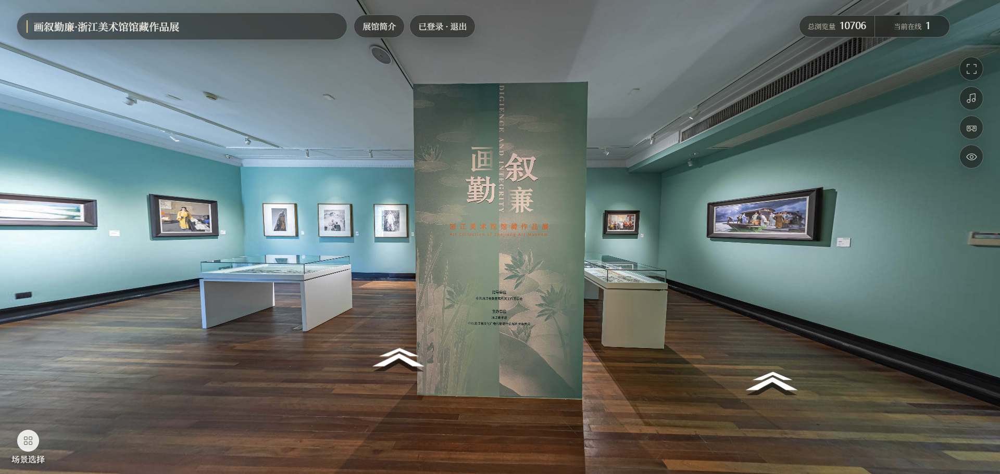

# 境界AR（Jingjie-AR）

> 自研 C++11 HTTP 服务框架 + A-Frame 360° 全景协作浏览应用。



`Jingjie-AR` 是一个用于展示 C++ 后端与工程化能力的作品集项目：底层是可被外部程序链接的 `http_framework`，上层是基于该框架构建的 ARServer。ARServer 提供八个 360° 全景场景，游客可浏览，登录用户可进入场景、查看在线成员、点赞和评论。


## 项目亮点

- **自研 C++11 网络与 HTTP 框架**：保留并组织 Multi-Reactor、`TcpServer`、`Buffer`、`TimerQueue`、异步日志与内存池；提供 HTTP/1.1 增量解析、Router、Middleware、CORS、Session、异步响应和静态资源能力。
- **清晰的异步边界**：MySQL、Redis 与业务写入经连接池和 `DBWorkerPool` 处理；EventLoop 不等待 MySQL、Redis、`future::get()` 或 `future::wait_for()`。
- **会话与缓存**：MySQL 是持久化数据源，Redis 用于共享缓存与在线状态，Session 支持 Redis 故障时回源 MySQL；关键写入失败以 503 返回。
- **境界AR全景门户**：本地固定 A-Frame 1.6，内置八个 WebP 全景场景；支持电脑鼠标拖动与滚轮缩放、手机单指转向与双指缩放，以及设备方向控制。
- **轻量协作能力**：登录后进入场景并通过 HTTP 心跳维持在线状态；成员列表使用轮询更新。已登录用户可点赞、取消点赞和发布评论，数据持久化到 MySQL。
- **质量保障**：开发过程覆盖框架、业务处理器、在线状态与静态页面/API 等关键路径的验证。 

## 架构

```text
浏览器（A-Frame 全景门户）
          │ HTTP/1.1
          ▼
      ar_server
          │ 路由 / 中间件 / 异步处理器
          ▼
   http_framework
 Multi-Reactor / TcpServer / Buffer / TimerQueue
          │
    ┌─────┴──────────┐
    ▼                ▼
 MySQL           Redis
用户、Session、互动   两级缓存、在线状态
```

本仓库的 C++ 服务端当前不内置 TLS。

## 已实现功能与 API

| 场景 | 能力 | 接口 |
| --- | --- | --- |
| 场景目录 | 返回八个场景的名称、全景图、缩略图与音乐字段 | `GET /api/scenes` |
| 场景详情 | 返回场景信息与点赞数 | `GET /api/scenes/:sceneId` |
| 注册/登录 | 新用户自动注册，已有用户校验密码并返回 Session Token | `POST /api/auth` |
| 进入/退出 | 登录用户进入或退出当前场景 | `POST /api/session/enter`、`POST /api/session/exit` |
| 在线协作 | 心跳续期与同场景成员轮询 | `POST /api/session/heartbeat`、`GET /api/scenes/:sceneId/members` |
| 点赞 | 登录用户点赞、取消点赞并读取总数 | `POST` / `DELETE /api/scenes/:sceneId/likes` |
| 评论 | 按游标读取和发布场景评论 | `GET` / `POST /api/scenes/:sceneId/comments` |

- 游客可以浏览全部全景场景。
- 点赞和评论按钮对游客可见，但操作会提示先登录。
- “在线人数”只统计已登录、已进入场景并持续发送心跳的用户；匿名浏览者不计入人数。
- 当前协作采用 HTTP 心跳与轮询，**未实现 WebSocket**。

## 工程质量与边界

### 框架可链接

`http_framework` 是独立的 CMake 库目标。外部 C++ 程序可以链接它，并注册自己的路由和中间件；ARServer 只通过框架的 HTTP 抽象处理请求，不直接依赖 `Channel`、`Socket` 或 `TcpConnection`。

### 安全与可靠性

- 配置从环境变量加载；数据库密码不写入源码。
- 不要提交 `.env.arserver`，也不要在 Issue、日志或截图中暴露密码、Token。
- 认证请求中的 `password` 查询参数会在访问日志中脱敏。
- 静态文件支持 MIME 类型、ETag/Last-Modified 与 Keep-Alive；发送文件处理部分发送、`EPOLLOUT` 和文件描述符关闭。

### 当前范围

- 已实现：HTTP/1.1、静态资源、CORS、Session、Redis/MySQL 回源、A-Frame 全景浏览、心跳/轮询协作、点赞评论。
- 未实现：WebSocket、AR 图像识别、场景热点/导航箭头、后端 TLS、HTTP/2、HTTP/3。
- `scene.music_url` 已预留；当前场景未配置音乐文件，浏览器也不会在无用户操作时强制播放有声媒体。

## 仓库结构

```text
.
├── include/                 # http_framework 对外头文件
├── src/                     # Reactor、HTTP、Router、中间件、Session、缓存实现
├── memory/                  # 槽位内存池
├── WebApps/ARServer/        # ARServer 业务层与前端静态资源
│   ├── include/             # 业务接口
│   ├── src/                 # 认证、Session、场景、互动、在线状态
│   └── www/                 # 境界AR页面、A-Frame 与全景 WebP 素材
├── sql/                     # 数据库迁移脚本
├── benchmark/               # 压测报告
└── CMakeLists.txt
```

主要技术：C++11、Linux epoll、HTTP/1.1、MySQL、Redis/hiredis、CMake、A-Frame 1.6、WebP。

## 本地运行

### 1. 安装依赖

Ubuntu/Debian 示例：

```bash
sudo apt update
sudo apt install -y build-essential cmake pkg-config \
  libmysqlclient-dev libhiredis-dev mysql-client redis-server
```

确保 MySQL 与 Redis 已启动，并创建供应用使用的数据库和最小权限用户。

### 2. 配置环境与初始化数据库

```bash
cp WebApps/ARServer/.env.example .env.arserver
# 编辑 .env.arserver；设置 MYSQL_PASSWORD，且不要提交 `.env.arserver`。

set -a; . ./.env.arserver; set +a
MYSQL_PWD="$MYSQL_PASSWORD" mysql -h "$MYSQL_HOST" -P "$MYSQL_PORT" \
  -u "$MYSQL_USER" "$MYSQL_DATABASE" \
  < sql/jingjie_ar_schema.sql
```

环境变量示例见 [WebApps/ARServer/.env.example](WebApps/ARServer/.env.example)。其中 `AR_STATIC_ROOT` 默认是 `WebApps/ARServer/www`，因此请从项目根目录启动程序。

### 3. 构建与启动

```bash
cmake -S . -B build -DCMAKE_BUILD_TYPE=Release
cmake --build build --target ar_server -j2

set -a; . ./.env.arserver; set +a
./build/bin/ar_server
```

浏览器访问 `http://127.0.0.1:8080`。开发环境可使用 Debug 构建：

```bash
cmake -S . -B build-debug -DCMAKE_BUILD_TYPE=Debug
cmake --build build-debug --target ar_server -j2
```

### 4. 本地验证

在浏览器打开 `http://127.0.0.1:8080`，可验证全景浏览、登录后点赞和评论、HTTP 心跳在线人数与评论抽屉。

完整数据库初始化脚本在 [sql/jingjie_ar_schema.sql](sql/jingjie_ar_schema.sql)，性能测试数据在 [benchmark/benchmark.md](benchmark/benchmark.md)。

## 贡献与许可证

欢迎通过 Issue 或 Pull Request 讨论改进。提交前请完成相应的本地验证，避免提交构建产物、全景母版素材、数据库密码或任何 Session Token。

项目使用 [MIT License](LICENSE)。全景素材与第三方内容应仅在获得相应授权后使用。
